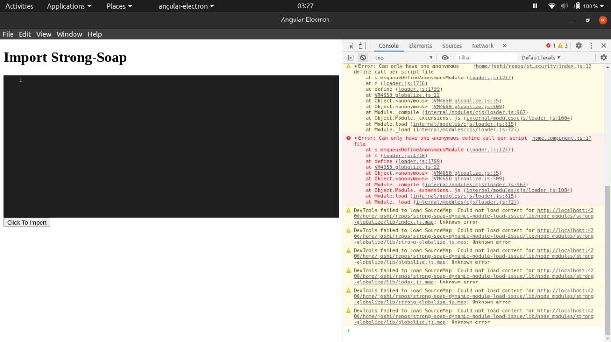

# STRONG SOAP DYNAMIC MODULE LOAD ISSUE

In this repo, I have tried to reproduce the issue when both monaco and strong-soap are included.

## Steps

-   Do `npm install` in `angular-app` and in the `lib` directory, in that order.
-   Create npm link for `lib` project by running `npm link` in `lib` directory.
-   run `npm link lib` in `angular-app` directory.
-   Run `npm start` in `angular-app` directory. (Wait for electron to open and load the angular app).
-   Once the angular app is loaded, click on the `Click To Import` button

Now, you should see an error in the devTools console

If the `<app-monaco></app-monaco>` in the `angular-app/src/app/home/home.component.html` file is commented, it will stop throwing the error
